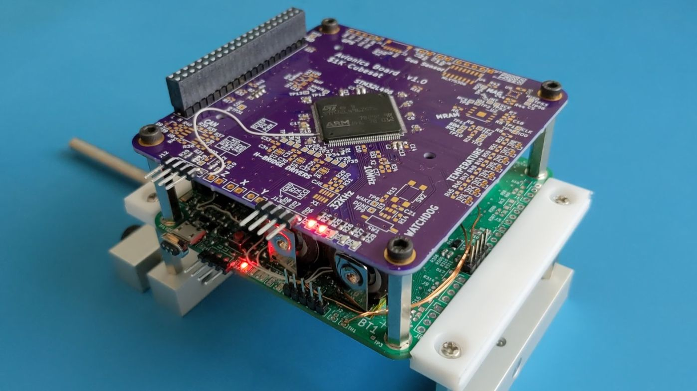
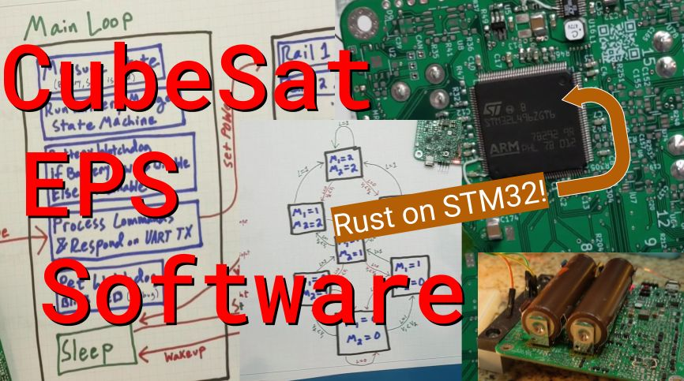

# 1KCubeSat Software

This repo contains all of the software used for my $1000 CubeSat.

* *Most of the software* -- My [fork of OpenLST](https://github.com/rgw3d/openlst) will eventually post some changes.

See the relevant subfolder READMEs for more information: [eps README](eps), [avionics README](avionics).

## Hardware

½ Cubesat Hardware ([avionics board](https://github.com/rgw3d/1KCubeSat_Hardware/tree/master/avionics_board) is stacked on the [eps board](https://github.com/rgw3d/1KCubeSat_Hardware/tree/master/eps_board))

## External

See [my video](https://www.youtube.com/watch?v=iNiHAczKNww) for more information on the software!

