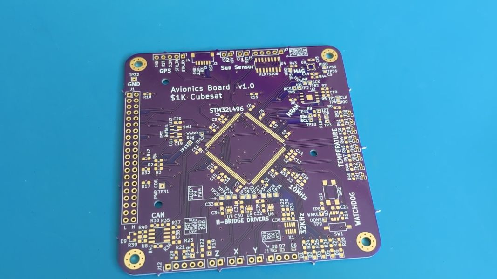
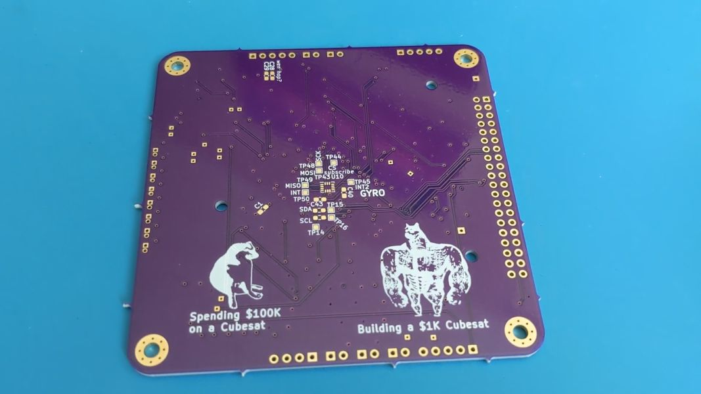

# Avionics Software

This repo contains rust code to run on the STM32 microcontroller of the Avoinics board for my 1KCubeSat project. Hardware design files of the Avionics board can be found [in the 1KCubeSat Hardware repo](https://github.com/rgw3d/1KCubeSat_Hardware/tree/master/avionics_board)

- The Avionics board is the "main computer" of the CubeSat. It reads from sensors and controls the radio.
- The Avionics software is responsible for telling the [EPS](../eps) what to do.

The STM32 microcontroller for this Avionics board is the STM32L496ZG.

## Why Rust?

C and C++ based development for STM32 platforms is very well established, and is something I have done before. Rust provided the perfect opportunity to try something new.

## Tooling setup with VSCode (Highlevel)

- The Cortex-Debug extension in VSCode provides the wrapper around GDB for debugging and stepping through the code.
- See [`.vscode/launch.json`](.vscode/launch.json) for Cortex-Debug launch configurations
- See [`../svd/`](../svd/README.md) for SVD register description files for STM32 devices.
- OpenOCD is the Debugger, and OpenOCD uses STLink to flash the STM32.
- OpenOCD opens a port for GDB to connect
- See [`../openocd_cfg/`](../openocd_cfg/README.md) for OpenOCD configuration files.

### Actually getting the above tooling to work

I complain about this in the [EPS README](../eps)

## Manually install on target MCU

If all else fails, here's a manual way to flash your micro

```bash
cargo build --release
arm-none-eabi-objcopy -O binary target/thumbv7em-none-eabihf/release/eps out.bin
st-flash --debug --reset --freq=100K write out.bin 0x8000000
```

## Protobuf setup

I use [Google Protocol buffers](https://developers.google.com/protocol-buffers/) (protobuf) to send messages back and forth from this microcontroller.
To make this work with Rust, and in a no-std environment, I use [quick-protobuf](https://github.com/tafia/quick-protobuf). This library allows me to set `default-features=false` which disables reliance on `std`. Using the provided `pb-rs` code generator, I can write `.proto` protobuf specifications.

- [src/messages.proto](src/messages.proto) contains the protobuf definition.
- `pb-rs` is installed via `cargo install pb-rs`
- Call `pb-rs src/messages.proto` to generate files. These should be generated in a subfolder of `src/`, and can be included into the project.
- Note that `quick-protobuf` requires an allocator, which I supply using `alloc_cortex_m`.

## [`cortex-m-quickstart`](https://github.com/rust-embedded/cortex-m-quickstart)

> See the cortex-m-quickstart repository for a template used to generate this repo

## Pictures



