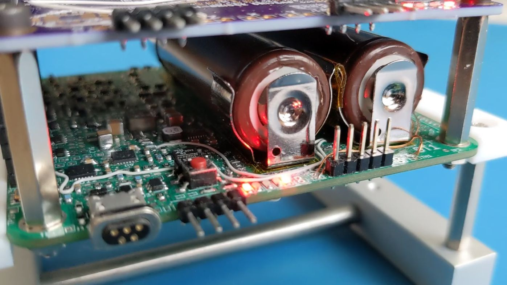

# EPS Software

This repo contains rust code to run on the PMIC of the EPS for 1KCubeSat project. Hardware design files of the EPS can be found [in the 1KCubeSat Hardware repo](https://github.com/rgw3d/1KCubeSat_Hardware/tree/master/eps_board)

- EPS stands for Electrical Power (Sub)System
- PMIC stands for Power Managment IC

The PMIC on this EPS is the STM32L496ZG.

## Why Rust?

C and C++ based development for STM32 platforms is very well established, and is something I have done before. Rust provided the perfect opportunity to try something new.

## Tooling setup with VSCode (Highlevel)

- The Cortex-Debug extension in VSCode provides the wrapper around GDB for debugging and stepping through the code.
- See [`.vscode/launch.json`](.vscode/launch.json) for Cortex-Debug launch configurations
- See [`../svd/`](../svd/README.md) for SVD register description files for STM32 devices.
- OpenOCD is the Debugger, and OpenOCD uses STLink to flash the STM32.
- OpenOCD opens a port for GDB to connect
- See [`../openocd_cfg/`](../openocd_cfg/README.md) for OpenOCD configuration files.

### Actually getting the above tooling to work

This is ***my*** repo, so I'll get on my soapbox.

**OpenOCD** isn't hard to [download](https://sourceforge.net/projects/openocd/), build and install, but the OpenOCD.cfg files are a mess.
Instead of writing my own, or being able to easily finding one online, I just copied the `.cfg` out of my SW4STM32 (an eclipse based editor for writing C code for STM32) IDE's plugin path.
Great! I have a `.cfg` for OpenOCD, but it only works with the SW4STM32 version of OpenOCD.
The SW4STM32 version runs a dirty version of `v0.10.0`, (`v0.10.0-dev-00021-g524e8c8` specifically).
Not sure what's going on there, but the same `.cfg` does NOT work with a clean `v0.10.0` of OpenOCD downloaded from the link above.
Here's what I've had to do in order to use OpenOCD.

- All OpenOCD config files that came with SW4STM32 can be [found in a subdirectory here](openocd_cfg/README.md)
- Change my VSCode global `settings.json` to include `"cortex-debug.openocdPath": "/path/to/Ac6/SystemWorkbench/plugins/fr.ac6.mcu.externaltools.openocd.linux64_1.23.0.201904120827/tools/openocd/bin/openocd"`
- Modify my `ldconfig` settings to include dynamic libraries so the above binary would run.

## Manually install on target MCU

If all else fails, here's a manual way to flash your micro

```bash
cargo build --release
arm-none-eabi-objcopy -O binary target/thumbv7em-none-eabihf/release/eps out.bin
st-flash --debug --reset --freq=100K write out.bin 0x8000000
```

## Protobuf setup

I use [Google Protocol buffers](https://developers.google.com/protocol-buffers/) (protobuf) to send messages back and forth from this microcontroller.
To make this work with Rust, and in a no-std environment, I use [quick-protobuf](https://github.com/tafia/quick-protobuf). This library allows me to set `default-features=false` which disables reliance on `std`. Using the provided `pb-rs` code generator, I can write `.proto` protobuf specifications.

- [src/messages.proto](src/messages.proto) contains the protobuf definition.
- `pb-rs` is installed via `cargo install pb-rs`
- Call `pb-rs src/messages.proto` to generate files. These should be generated in a subfolder of `src/`, and can be included into the project.
- Note that `quick-protobuf` requires an allocator, which I supply using `alloc_cortex_m`.

## [`cortex-m-quickstart`](https://github.com/rust-embedded/cortex-m-quickstart)

> See the cortex-m-quickstart repository for a template used to generate this repo

## Pictures


